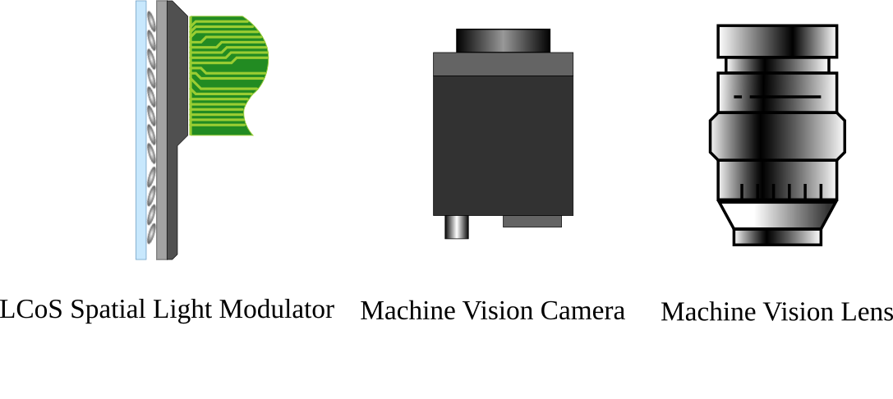

# Computational Photography Symbols

This repository contains vector graphics for symbols commonly used in computational photography. The project in a sense adds new symbols to [ComponentLibrary](http://www.gwoptics.org/ComponentLibrary/) and is not a standalone library.

# Usage

## Edit SVG file
Fork this library and open the SVG files with your favorite vector graphics editor such as [InkScape](https://inkscape.org/).

## PNG files
All individual components are exported as PNG files in images/ at 1200DPI.

# Current set of symbols

